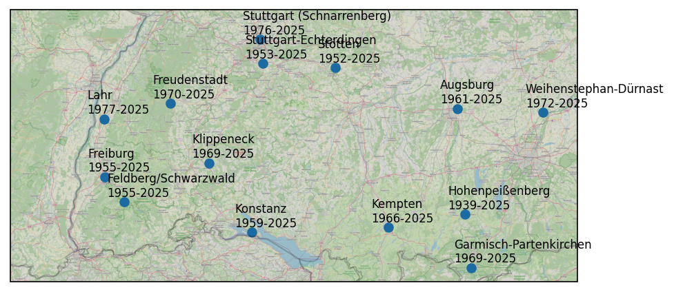

# German Weather Service (DWD) Open Data Client

[](https://img.shields.io/badge/python-3.13+-blue.svg)
[](https://img.shields.io/badge/license-MIT-green.svg)
[](https://img.shields.io/badge/status-experimental-orange.svg)
[](https://img.shields.io/badge/managed%20by-uv-de3423.svg)
[](https://img.shields.io/pypi/v/dwd_opendata.svg)
[](https://github.com/iskur/dwd_opendata/actions/workflows/build.yml/badge.svg)

A Python library for downloading and processing meteorological data from
the German Weather Service (Deutscher Wetterdienst - DWD) open data
platform.

# Features

- Load data from multiple stations and variables into xarray DataArrays
- Station mapping functionality to identify which stations provide
  specific variables
- Automatic handling of DWD data structure idiosyncrasies

# Status

⚠️ **Experimental**: This library is under active development and the
API is not stable yet.

# Installation

This project uses [uv](https://docs.astral.sh/uv/) for package
management. If you don't have uv installed, follow the [installation
instructions](https://docs.astral.sh/uv/getting-started/installation/).

## From source

Clone the repository and install with uv:

``` bash
git clone https://github.com/yourusername/dwd_opendata_client.git
cd dwd_opendata_client
uv sync
```

## Development installation

To install with development dependencies:

``` bash
uv sync --all-extras
```

# Key Dependencies

- [xarray](https://xarray.dev/) - For handling multi-dimensional
  meteorological data
- [pandas](https://pandas.pydata.org/) - Data processing and
  manipulation
- [cartopy](https://scitools.org.uk/cartopy/) - Mapping and geospatial
  visualization

All dependencies are managed by uv and will be installed automatically
with `uv sync`.

# Usage

Find stations that offer a set of variables within a bounding box and
time frame:

``` python
import dwd_opendata as dwd
from datetime import datetime

start = datetime(1980, 1, 1)
end = datetime(2016, 12, 31)
variables = ("wind", "air_temperature", "sun", "precipitation")
fig, ax = dwd.map_stations(
    variables,
    lon_min=7,
    lat_min=47.4,
    lon_max=12.0,
    lat_max=49.0,
    start=start,
    end=end,
)
```



Download data for multiple stations and variables at once and load as an
`xarray.DataArray:`

``` python
data = dwd.load_data(
    ("Konstanz", "Feldberg/Schwarzwald"),
    variables=variables,
    start_year=start,
    end_year=end,
)
```

# Data Directory

By default, data is stored in `~/.local/share/opendata_dwd` (following
XDG Base Directory specification). You can override this by setting the
`XDG_DATA_HOME` environment variable.

# CI/CD and Publishing

The project uses GitHub Actions to automatically build wheels on pushes
to main and publish to PyPI when a version tag is created.

## Releasing a New Version

To release a new version:

1.  Update the version in `pyproject.toml`
2.  Update the relevant section in `CHANGELOG.md` with release notes
3.  Create a git tag: `git tag vX.Y.Z`
4.  Push the tag: `git push origin vX.Y.Z`

The GitHub Actions workflow will automatically:

- Build wheels
- Create a GitHub Release with the changelog excerpt
- Publish the wheels to PyPI

## Building Locally

To build wheels locally using uv:

``` bash
uv build
```

The wheels will be created in the `dist/` directory.

## Testing Releases on TestPyPI

Before releasing to production PyPI, you can test the publishing
workflow on TestPyPI:

1.  Create a test tag: `git tag vX.Y.Z-test`
2.  Push the tag: `git push origin vX.Y.Z-test`
3.  Monitor the workflow at
    <https://github.com/iskur/dwd_opendata/actions>
4.  Verify the release on <https://test.pypi.org/project/dwd_opendata/>
5.  Test installation:
    `pip install --index-url https://test.pypi.org/simple/ --extra-index-url https://pypi.org/simple/ dwd_opendata`

Once verified, create the production release tag without the `-test`
suffix.

# License

This project is licensed under the MIT License - see the
\[LICENSE\](LICENSE) file for details.

# Acknowledgments

Data provided by Deutscher Wetterdienst (DWD) - German Weather Service
